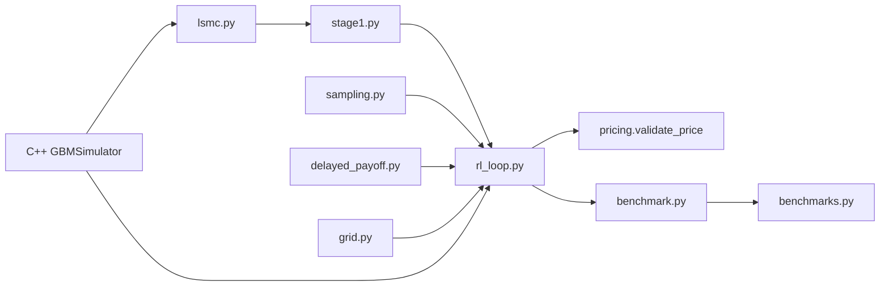

# CARLOS-core

Continuous-time Adaptive Reinforcement Learning for Optimal Stopping.

Reference: [arxiv:2606.17545](https://arxiv.org/pdf/2606.17545)

## Build

```bash
pip install -r requirements.txt
cmake -B build -DCMAKE_BUILD_TYPE=Release
cmake --build build
cmake --install build --prefix .
pip install -e .
```

## Tests

```bash
pip install -r requirements-dev.txt
pytest tests/ -q
python test_bridge.py
```

## Pipeline

Run `python -m carlos` with no arguments for an interactive command guide.

| Command | Description |
|---------|-------------|
| `python -m carlos benchmark list` | All seven paper contracts + Table 3 targets |
| `python -m carlos benchmark b1` | **Official B1 benchmark** (pass/fail exit code) |
| `python -m carlos benchmark b2` … `m5b` | Other paper benchmarks |
| `python -m carlos benchmark all` | Full suite (very slow) |
| `python -m carlos train --dev --loops 3` | Smoke test — reduced paths, not scored |
| `python -m carlos train --profile` | Full training with timing breakdown |
| `python -m carlos stage1` | Stage 1 LSMC → ADNN `R^[0]` |

## Results (Table 3 CARLOS targets)

Baseline measured before optimization work (Apple Silicon, CPU scoring path):

| Contract | Target | Your price | Time | Status |
|----------|--------|------------|------|--------|
| B1 | 4.592 ± 0.05 | 4.5665 | ~742 s | **PASS** |
| B2 | 1.474 ± 0.05 | — | — | pending |
| M2.A | 14.171 ± 0.05 | — | — | pending |
| M2.B | 15.711 ± 0.066 | — | — | pending |
| M3 | 11.510 ± 0.05 | — | — | pending |
| M5.A | 26.55 ± 0.096 | — | — | pending |
| M5.B | 12.009 ± 0.05 | — | — | pending |

Re-run after optimizations with `python -m carlos benchmark <preset>`. Use `--profile` on `train` to see phase timings.

## B1 benchmark

Table 3 target: **4.592** (acceptance ±0.05 on finest exercise grid).

```bash
python -m carlos benchmark b1 --seed 0 --loops 5
```

- Uses Table 6 path counts (10,000)
- Training seed `0`; validation path bank seed `1000`
- Exit code `0` = pass, `1` = fail

See [docs/adr/0001-b1-benchmark-scoring-protocol.md](docs/adr/0001-b1-benchmark-scoring-protocol.md) and [docs/adr/0002-paper-benchmark-suite.md](docs/adr/0002-paper-benchmark-suite.md).

## Architecture


