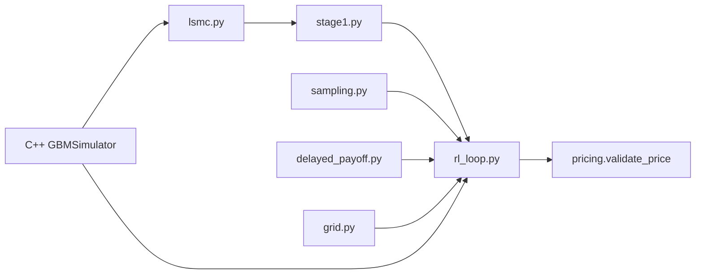

# CARLOS-core

Continuous-time Adaptive Reinforcement Learning for Optimal Stopping.

Reference: [arxiv:2606.17545](https://arxiv.org/pdf/2606.17545)

## Build

```bash
pip install -r requirements.txt
cmake -B build -DCMAKE_BUILD_TYPE=Release
cmake --build build
cmake --install build --prefix .
```

## Tests

```bash
pip install -r requirements-dev.txt
pytest tests/ -q
python test_bridge.py
```

## Pipeline

| Command | Description |
|---------|-------------|
| `PYTHONPATH=. python -m carlos stage1` | Stage 1 LSMC → ADNN `R^[0]` |
| `PYTHONPATH=. python -m carlos train --dev --loops 3` | Full Stage 2 RL (dev mode) |
| `PYTHONPATH=. python -m carlos agent` | V1 simplified smoke test |
| `PYTHONPATH=. python -m carlos price --dev` | Stage 1 init + validate price |

Direct modules:

```bash
PYTHONPATH=. python -m carlos.stage1
PYTHONPATH=. python -m carlos.rl_loop --dev --loops 3
PYTHONPATH=. python -m carlos.agent
```

## Expected B1 benchmark

Table 3 CARLOS target: **4.592**. Dev mode uses fewer paths; use full Table 6 params for production runs.

## Architecture


