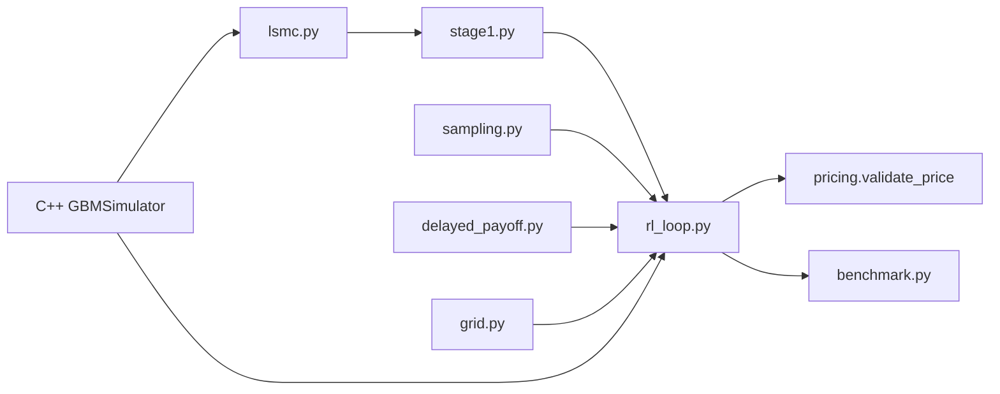

# CARLOS-core

Continuous-time Adaptive Reinforcement Learning for Optimal Stopping.

Reference: [arxiv:2606.17545](https://arxiv.org/pdf/2606.17545)

## Build

```bash
pip install -r requirements.txt
cmake -B build -DCMAKE_BUILD_TYPE=Release
cmake --build build
cmake --install build --prefix .
```

## Tests

```bash
pip install -r requirements-dev.txt
pytest tests/ -q
python test_bridge.py
```

## Pipeline

| Command | Description |
|---------|-------------|
| `PYTHONPATH=. python -m carlos benchmark b1` | **Official B1 benchmark** (pass/fail exit code) |
| `PYTHONPATH=. python -m carlos train --dev --loops 3` | Smoke test — reduced paths, not scored |
| `PYTHONPATH=. python -m carlos stage1` | Stage 1 LSMC → ADNN `R^[0]` (dev paths in module main) |
| `PYTHONPATH=. python -m carlos agent` | V1 simplified smoke test |

Direct modules:

```bash
PYTHONPATH=. python -m carlos.rl_loop --dev --loops 3 --seed 0
PYTHONPATH=. python -m carlos.stage1
```

## B1 benchmark

Table 3 target: **4.592** (acceptance ±0.05 on finest exercise grid).

```bash
PYTHONPATH=. python -m carlos benchmark b1 --seed 0 --loops 5
```

- Uses Table 6 path counts (10,000)
- Training seed `0`; validation path bank seed `1000`
- Exit code `0` = pass, `1` = fail
- Do **not** use `--dev` for benchmark scoring (smoke tests are separate)

See [docs/adr/0001-b1-benchmark-scoring-protocol.md](docs/adr/0001-b1-benchmark-scoring-protocol.md).

## Architecture


